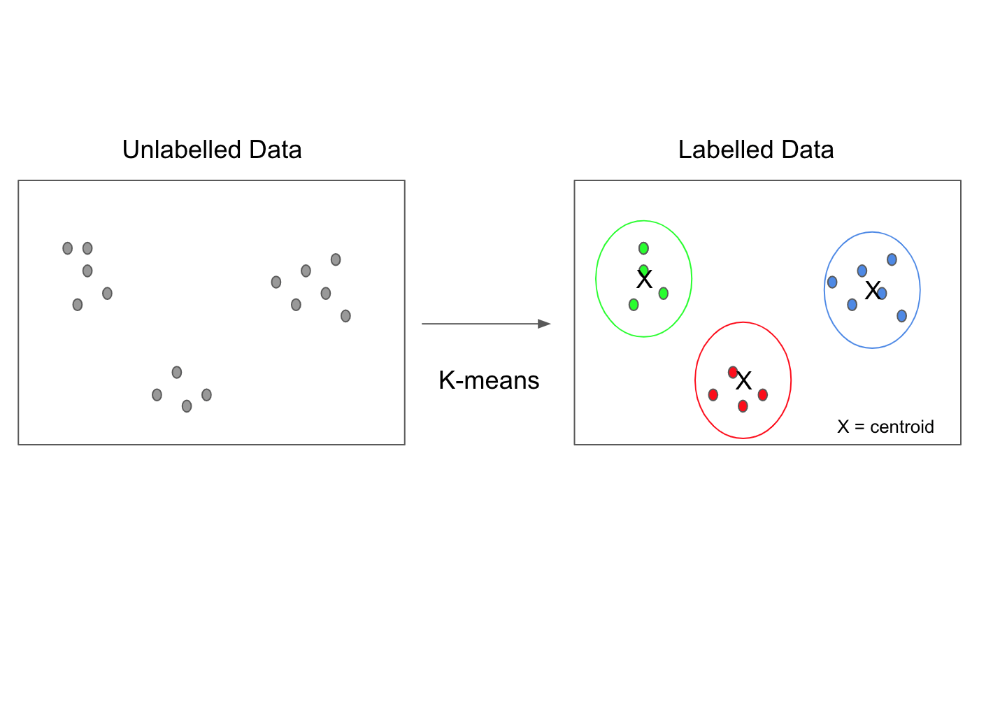

# K-means

O K-Means é um algoritmo de agrupamento que divide os dados em k clusters de forma que os pontos dentro de cada cluster sejam similares entre si e distintos dos outros clusters. Ele atribui os pontos iniciais de forma aleatória e, em seguida, ajusta os centróides dos clusters iterativamente para otimizar a separação dos dados. O processo continua até que os centróides se estabilizem ou o número máximo de iterações seja alcançado, resultando em k grupos bem definidos. É amplamente usado para agrupamento não supervisionado em diversos problemas de análise de dados.

