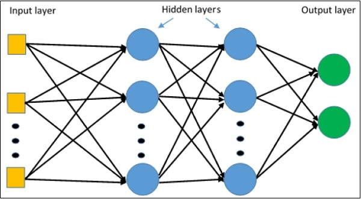

# MLP Multi Layer Perceptron

O MLP (Multi-Layer Perceptron) é uma arquitetura de rede neural artificial composta por múltiplas camadas de neurônios interconectados. Cada neurônio recebe entradas ponderadas, aplica uma função de ativação e gera uma saída que pode ser enviada para a próxima camada. O processo de treinamento envolve ajustar os pesos das conexões entre os neurônios para minimizar o erro entre as previsões e os valores reais durante a etapa de treinamento.

