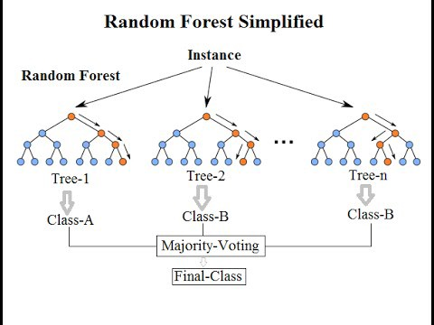

# Random Forest

Random Forest é um algoritmo de aprendizado de máquina baseado em ensemble que combina várias árvores de decisão para fazer previsões mais precisas. Cada árvore é treinada em uma amostra aleatória dos dados e utiliza uma seleção aleatória de características. Ao combinar as previsões de várias árvores, o Random Forest reduz o overfitting e melhora a generalização do modelo. É amplamente utilizado em problemas de classificação e regressão devido à sua eficácia e versatilidade.

