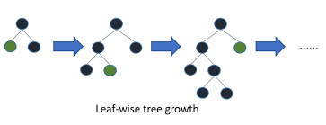

# XGboost (Decision Tree)

O XGBoost (Extreme Gradient Boosting) é um algoritmo de aprendizado de máquina baseado em boosting. Ele combina várias árvores de decisão fracas para criar um modelo mais forte e complexo. O processo de treinamento do XGBoost é feito de forma sequencial, onde cada árvore é ajustada para corrigir os erros cometidos pelas árvores anteriores.

O algoritmo inicia com uma única árvore de decisão simples, chamada de árvore base (ou árvore raiz). Em seguida, ele calcula os erros residuais entre as previsões do modelo atual e os valores verdadeiros do conjunto de treinamento. Esses erros residuais representam a diferença entre as previsões do modelo e os rótulos corretos para cada exemplo no conjunto de treinamento.

A árvore seguinte é treinada para corrigir esses erros residuais. Ela é construída de forma que suas previsões sejam ajustadas para minimizar os erros residuais do modelo anterior. Esse processo é repetido para um número predefinido de árvores, e cada nova árvore adicionada ao modelo é projetada para corrigir os erros cometidos pelas árvores anteriores.

No final, o XGBoost combina as previsões de todas as árvores para obter a previsão final do modelo. As árvores têm pesos diferentes nas previsões com base em sua eficácia na redução dos erros do modelo.

